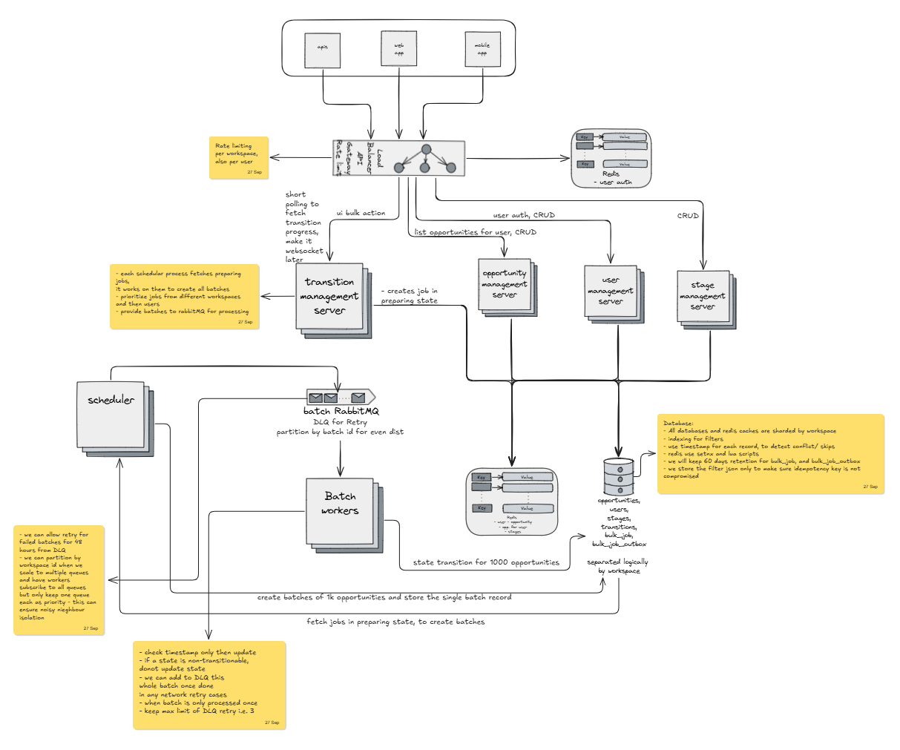

# Design

How a bulk stage move is chunked, made idempotent, kept correct while people edit the
same records, and isolated. Numbers are in `BENCHMARKS.md`; the tests guarding each
claim are in `TESTSTRATEGY.md`.

## 0. The shape of it

After step 1 the job row is the only thing that exists; nothing is held in memory.

| # | step | what it does | the part that is not obvious |
|---|---|---|---|
| 1 | **Submit** | Resolves the filter to stage ids, writes **one** job row with `snapshot_at = now()`, returns `201` in ~13 ms | No batch exists yet, so the row defaults to `preparing`, the state a job with no batches is actually in |
| 2 | **Batching** | A 125 ms sweep claims the job with an advisory lock, walks the filter keyset-style, 1,000 ids per page | Each page commits its batch **and** the cursor after it, in one transaction |
| 3 | **Relay** | A 125 ms timer publishes unpublished batch rows | Marked published only *after* the broker confirms, so a crash re-publishes rather than loses |
| 4 | **Drain** | 12 consumers take a per-batch lock, claim `pending → running`, apply in one transaction | Those two guards make at-least-once effectively-once, see 3 |
| 5 | **Status** | `GET /bulk-moves/:id`, progress, batches, failures, dead letters | A dead-lettered message does not stop the rest of the job |

## 1. Chunking, and surviving a restart

- **Submit writes one row:** `now()`, status `preparing`.
- **Index** `(workspace_id, created_at, id)`, so a page is an index range, not a scan.
- **The sweep** every 125 ms takes `preparing` jobs, reads the last cursor, writes the next 1,000 ids as one batch, until nothing matches.
- **The cursor is stored after every batch, in the same transaction as the batch.** Ahead skips records, behind duplicates them.
- **A half-built job resumes, it does not restart.** Still `preparing`, so the next sweep carries on from the cursor. Written batches keep draining.
- **No `OFFSET` here.** It re-reads every row it skips. The worker does not page at all.

## 2. Idempotency

- **Key:** caller-supplied, on the job row. `UNIQUE (workspace_id, idempotency_key)`.
- **Submit looks the key up.** No match: insert. Match: insert nothing.
- **Then compare** the stored job's target stage and filter against the request.
- **Both match:** a retry. Return the same `jobId`, create nothing.
- **Either differs:** the key was reused for something else. **409**, change nothing.
- **The filter is compared resolved.** `outcome=won` becomes stage ids first, so two spellings of one request match.
- **Keys are never freed.** A column on the row, and there is no delete route.
- **What this does not catch:** the same intent sent under a different key. A client that generates a fresh uuid per attempt gets a new job each time, and nothing here can tell that apart from a deliberate re-run.

## 3. Concurrency on one opportunity

Six checks, fixed order. The order is load-bearing.

| # | check | outcome |
|---|---|---|
| 1 | the record still exists | fail |
| 2 | **is already in the target stage** | count as **moved** |
| 3 | `record.stage_decided_at <= job.snapshot_at` | **skip** |
| 4 | still in a stage the filter names | **skip** |
| 5 | a permitted transition to the target exists | fail |
| 6 | not a check, the action itself | **move**, insert one transition |

- **Check 2 must precede 3.** A person who moved a record *to* the target stamped
  it newer than the job, so testing the clock first under-counts a job that
  achieved its intent, and breaks retry idempotency.
- **A manual move and the job on one record → the person wins.** Before the
  watermark the job takes the new stage as its start; after it the record is
  skipped and the shortfall reported.
- **`stage_decided_at` is a logical clock**, a person stamps the wall clock, a
  job stamps its own `snapshot_at`, so `stage_decided_at > snapshot_at` compares
  *submission* order. Newest job wins however long the older takes, and every
  timestamp comes from the one Postgres, so no clock sync.
- **Two `WHEN` clauses on the trigger, both load-bearing:**
  `OLD.stage_id IS DISTINCT FROM NEW.stage_id`, so a rename cannot drop a record
  from an in-flight job; and `NEW.stage_decided_at IS NOT DISTINCT FROM
  OLD.stage_decided_at`, the opt-out, the worker sets the column so the trigger
  stands down, because without it a job would stamp 1,000 rows with the wall
  clock and defeat the design.
- **No `version` column**, the second save wins. See 7.

## 4. Snapshot vs live

**Snapshot. The decision is taken once at submission, and the job is scheduled
against that frozen copy, the request is never consulted again.**

- `submit()` resolves `outcome` → stage ids, canonicalises, and writes the result
  plus a watermark onto `bulk_job`. The walk reads `job.filter` and
  `job.snapshot_at` off that row.
- **The stored filter is already resolved,** so renaming a stage or changing its
  outcome cannot alter an in-flight job, and the row is a complete audit without
  the original request.
- **The decision is snapshotted, not the ids**, the match set materialises
  lazily, 1,000 a page, which keeps submit O(1): 50 batch rows, not 50,000 item
  rows, which were **81% of the time to the `201`**. Snapshotting the ids at
  submit is the design that took 32.06 s at 500,000.
- **Scheduled immediately, not by a timer**, the row defaults to `preparing` and
  `submit()` then calls `void this.builder.sweep()` before returning, so the walk
  starts in **10 ms**. The sweep timer is the fallback, not the mechanism.
- **The count is not knowable at submit**, `totalMatched` stays 0 while
  `preparing`. Ids are not known at t=0, only the filter is.
- **A record can still leave scope**, the filter is frozen but *stage membership*
  is not, so a record matched at t=0 may have left a named stage by the time its
  batch is written. Check 4 skips it as left-scope.
- **A record created after submit can never be swept up**,
  `created_at <= snapshot_at`, bound once at insert, not `now()` per query, which
  would advance mid-walk and re-open the set.

## 5. Isolation, and the hole

- **Composite foreign keys.** Every table carries `workspace_id NOT NULL`; every
  cross-table reference is `(id, workspace_id)`. An opportunity *cannot* point at
  another workspace's stage, the insert fails whatever the service does.
- **Query scoping is the weaker half.** Every repository query filters on
  `workspace_id` explicitly, because a `WHERE` clause is not implied by a foreign
  key. Convention, not guarantee.
- **The hole:** isolation is per *row*, not per *connection*. One database and one
  credential set means one forgotten predicate leaks another tenant's rows with
  no error. No row-level security, and no test can prove the absence of a future
  mistake.

## 6. What breaks at 10×

- **500,000 in one job still completes**, 500,000 moved, 0 failed, 58.71 s.
- **Already broke, now fixed:** submission was super-linear, 0.56 s at 50,000
  became **32.06 s at 500,000**, holding every id in memory (50–100 MB). It now
  streams. The job total barely moved, 57.34 s before, 58.71 s now: the fix took
  32 s off the *response*, not the job.
- **The constraint moves from the drain to batching**, 0.70x work-per-slot at
  50,000, **2.11x** at 500,000 (55.91 s of batching against 26.49 s per slot,
  per-page 18 ms → 112 ms). Batching scales in rows; the drain does not.
- **The cause is the working set, not the index**, `shared_buffers` is 128MB, the
  index 44MB at 50,000 rows and ~17GB at 20M, but a job reads one tenant's slice.
- **Noisy neighbour is structural.** The sweep claims `ORDER BY created_at LIMIT
  10` across all workspaces, so one tenant filling that window delays everyone,
  and one 500,000-record job is 2.11x the whole drain. No fairness, no
  `limit_req`.
- **Adding servers breaks on connections, not cores.** `PG_POOL_MAX` is 10, and
  12 for the worker, which must be ≥ its consumer count because `processBatch`
  holds a connection for the whole batch. `max_connections` is **100**, the
  Postgres default, and six services already hold ~62. The session-scoped lock
  is what makes it linear: it cannot be taken through the pool, so a connection
  is pinned per consumer. A pooled design would add capacity per replica; this
  adds connections.
- **Fix, in order:**
  1. **Fair queueing, ahead of any rate limit**, round-robin per workspace, or
     cap in-flight jobs. No migration, and the only measure that touches a few
     *large* jobs from one tenant; a request-rate limit cannot, since one request
     can be 500,000 records.
  2. **Rate limit on submit**, a Postgres counter. Meter on row creation, not
     the replay path, so a retry is not charged twice. Not a volume limit: section 4
     leaves `totalMatched` at 0 until the walk ends, so records-per-minute must be
     metered in the builder.
  3. **Partition `opportunity` by `workspace_id`**, sub-partitioned by
     `created_at`, every job-path query already constrains `workspace_id` on the
     leading index column, so pruning is exact with no query change. The PK widens
     to `(workspace_id, id)`, but `opportunity_id_workspace_uniq` already has
     that shape, so the transition FK survives.
  4. **Row-level security in the same change as 3**, partitioning turns section 5's
     missing predicate into a full-partition scan.
  5. **Replicas**, more builders is the only way to speed one huge job, because
     page N+1's cursor is page N's last row; more workers drain concurrent jobs,
     no code change. Both already safe at N. The relay is safe at N too: it claims
     with `FOR UPDATE SKIP LOCKED` ordered by `attempts` then `created_at`, so two
     relays take disjoint rows rather than both publishing one batch.
  6. **Past the ceiling**, PgBouncer cannot help, because transaction pooling
     hands two workers the same key on two backends. Raise `max_connections`, or
     a lease table with expiry.
  7. **Revisit the 1,000 batch size**, a guess, not a measurement.
- **What does not break:** the drain, 392 ms per batch across 12 slots,
  independent of workspace size. The outbox is 20,000 rows at 20M opportunities.

## 7. Another week, ranked

By dependency, not size: 2 enables 3, and 5 enables 6.

1. **`opportunity.version`**, the one real concurrency gap. `WHERE version =
   $expected`, reject the later save 409. **A bulk job must never bump it**, or a
   job moving 1,000 records hands every affected user a 409 about a field they
   never edited.
2. **Retention at 60 days** on `bulk_job`, `bulk_job_outbox` and
   `bulk_job_failure`. **Not** `opportunity_transition` - the audit trail must
   outlive the job row. Makes 3 possible; 60 days is far longer than any client
   retry window.
3. **Clear the idempotency key past retention**, closing the section 8 gap, a key is
   reserved for the life of its row and nothing ever frees it, so the unique index
   grows without bound and a key can never be reused.
4. **Redis, for two of the three things it is wanted for**, a token bucket for
   the rate limit, and replacing the session-scoped advisory locks so the design
   survives connection pooling, which is what would make PgBouncer usable.
   **Not the idempotency key:** the unique constraint is transactional and durable
   where a Redis key is neither, and Redis cannot commit atomically with the
   insert, so the constraint stays regardless and the lookup gains roughly nothing
   against a 13–22 ms submit.
5. **ZooKeeper or etcd for worker and scheduler membership, one, not both.**
   Both give ephemeral leases and watches, which is what "bring up a worker as
   required" needs and what a database transaction cannot span. **etcd** is the
   cheaper bet, a static binary, gRPC, the library Kubernetes already ships.
   **ZooKeeper** is heavier but has more very-large-cluster evidence. Register on
   start, deregister on shutdown, watch for peers instead of waking on a timer.
6. **Multi-region, which needs 5 first**, quorum consensus, the coordination
   service, geo-aware worker placement. It opens a question this design does not
   answer: a bulk move crossing a border is a data-residency problem, not a
   latency one.

## 8. Known gaps

True now, and would bite at scale.

- **A given-up batch is retried only when a caller asks**,
  `POST /bulk-moves/:id/retry-failed` resets it to `pending` and clears
  `published_at`, so the relay republishes it. Nothing retries on its own: the
  condition that stopped the batch is usually gone by the time anyone notices, and
  a silent retry would hide the failure it was retrying. Until it is called, those
  records are **in neither the per-record failures nor the job's counters - they
  are simply not moved** - which is why `deadLettered` is reported on the status
  response and worth alerting on.
- **Idempotency keys are never cleared**, a key lives as long as its row, so the
  constraint grows without bound and a key cannot be reused even after its job is
  deleted. A retention window fixes both, and a job must outlive any retry a
  client might make.
- **Nothing prunes `bulk_job` or `opportunity_transition`**, both grow without
  bound, and the transition table is the audit trail.
- **Batching's per-page cost is not separated from contention**, how much of the
  18 ms is the walk's own work is unknown; a quiet table costs ~7 ms.
- **Batching got ~2x faster when only a timer changed**, per-page mean 41–47 ms
  to 16–31 ms, and the tick is not on the page-write path. Unexplained; likeliest
  cause is contention, but the direction is backwards from what the new overlap
  predicts.
- **Queue wait is the largest cost at 177 ms and the tick does not set it**,
  halving the interval moved it only 195 → 177 ms. An earlier 3-run reading said
  it doubled; 5 runs per tick says otherwise, and the two sets overlap.
- **The record count at which waiting stops dominating a small job is not
  re-measured**, the floor is ~125 ms not ~250 ms, so the crossover moved, but
  the smallest filter measured is 5,050 records. Quote no threshold until the
  bench runs below 1,000.
- **Batching is single-threaded per job** and cannot be otherwise, because each
  page's cursor is the previous page's last row. Only *different* jobs
  parallelise, which is what the per-job claim is for.

## 9. Design decisions

One line each; the sections above are the reasoning.

- **Submission returns before the work starts**, the walk runs in
  `SnapshotBuilder` afterwards, resumed from a cursor.
- **A job row defaults to `preparing`, not `pending`**, a job exists before its
  batches do; the opposite default produced a silent hang.
- **Batches hold ids, not one row per record**, 50 rows of 1,000 uuids.
- **`stage_decided_at` is a logical clock**, newest job wins, no clock sync. See 3.
- **One batching pass per job, enforced by the database**, an advisory lock, so
  it is Postgres's rule, not a property of there being one replica.
- **Dispatch is an outbox**, batch rows and the intent to send them commit
  together.
- **The scheduler is in-process, not a broker message**, so an abandoned job is
  picked up by whichever replica is alive.
- **A correlation id is minted at the edge**, validated against
  `^[A-Za-z0-9._:-]{1,64}$`, a newline would let a client forge a log line.
- **One exchange and one queue.** No dead letter queue and no retry queues: a
  batch that runs out of attempts is marked `failed` in `bulk_job_outbox` with its
  reason, plus a `bulk_job_failure` row per record, and the message is acked. A
  queue would only repeat what the batch row already says and could not be
  queried. The attempt count is that row's own `attempts` column, incremented by
  the same transaction that claims the batch, so the number that stops a retry and
  the row that records why are the same fact. `POST /bulk-moves/:id/retry-failed`
  puts a given-up batch back, by clearing `published_at` so the relay republishes
  it.
- **A dash in a benchmark table** means the instrumentation did not exist for
  that configuration, not that the figure is zero.
